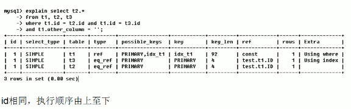
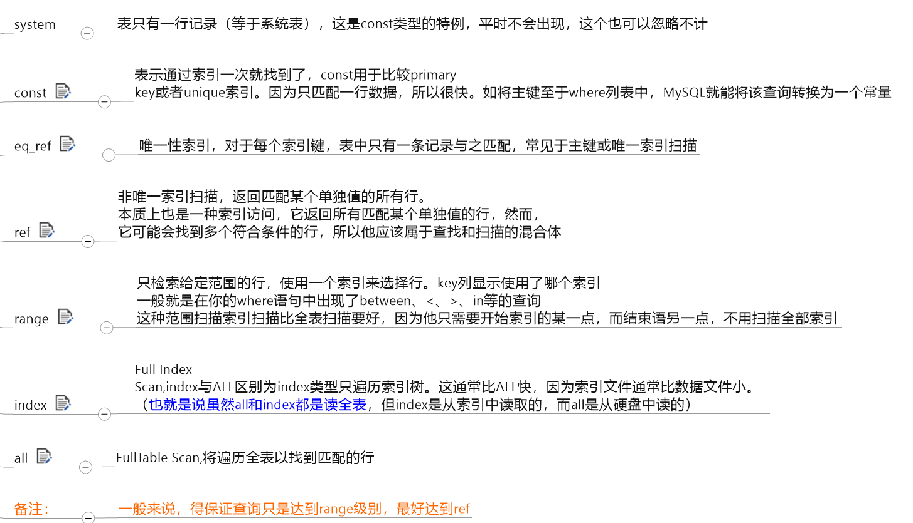

# MySQL
## 逻辑框架


###  Connectors

指的是不同语言中与SQL的交互
### Management Serveices & Utilities： 
系统管理和控制工具
### Connection Pool: 连接池
管理缓冲用户连接，线程处理等需要缓存的需求。
负责监听对 MySQL Server 的各种请求，接收连接请求，转发所有连接请求到线程管理模块。每一个连接上 MySQL Server 的客户端请求都会被分配（或创建）一个连接线程为其单独服务。而连接线程的主要工作就是负责 MySQL Server 与客户端的通信，
接受客户端的命令请求，传递 Server 端的结果信息等。线程管理模块则负责管理维护这些连接线程。包括线程的创建，线程的 cache 等。

### SQL Interface: SQL接口。

接受用户的SQL命令，并且返回用户需要查询的结果。比如select from就是调用SQL Interface
### Parser: 解析器。
SQL命令传递到解析器的时候会被解析器验证和解析。解析器是由Lex和YACC实现的，是一个很长的脚本。
在 MySQL中我们习惯将所有 Client 端发送给 Server 端的命令都称为 query ，在 MySQL Server 里面，连接线程接收到客户端的一个 Query 后，会直接将该 query 传递给专门负责将各种 Query 进行分类然后转发给各个对应的处理模块。
主要功能：
a . 将SQL语句进行语义和语法的分析，分解成数据结构，然后按照不同的操作类型进行分类，然后做出针对性的转发到后续步骤，以后SQL语句的传递和处理就是基于这个结构的。
b.  如果在分解构成中遇到错误，那么就说明这个sql语句是不合理的
### Optimizer: 查询优化器。
SQL语句在查询之前会使用查询优化器对查询进行优化。就是优化客户端请求的 query（sql语句） ，根据客户端请求的 query 语句，和数据库中的一些统计信息，在一系列算法的基础上进行分析，得出一个最优的策略，告诉后面的程序如何取得这个 query 语句的结果
他使用的是“选取-投影-联接”策略进行查询。
       用一个例子就可以理解： select uid,name from user where gender = 1;
       这个select 查询先根据where 语句进行选取，而不是先将表全部查询出来以后再进行gender过滤
       这个select查询先根据uid和name进行属性投影，而不是将属性全部取出以后再进行过滤
       将这两个查询条件联接起来生成最终查询结果

### Cache和Buffer： 查询缓存。
他的主要功能是将客户端提交 给MySQL 的 Select 类 query 请求的返回结果集 cache 到内存中，与该 query 的一个 hash 值 做一个对应。该 Query 所取数据的基表发生任何数据的变化之后， MySQL 会自动使该 query 的Cache 失效。在读写比例非常高的应用系统中， Query Cache 对性能的提高是非常显著的。当然它对内存的消耗也是非常大的。
如果查询缓存有命中的查询结果，查询语句就可以直接去查询缓存中取数据。这个缓存机制是由一系列小缓存组成的。比如表缓存，记录缓存，key缓存，权限缓存等
### 存储引擎接口

存储引擎接口模块可以说是 MySQL 数据库中最有特色的一点了。目前各种数据库产品中，基本上只有 MySQL 可以实现其底层数据存储引擎的插件式管理。这个模块实际上只是 一个抽象类，但正是因为它成功地将各种数据处理高度抽象化，才成就了今天 MySQL 可插拔存储引擎的特色。
     从图2还可以看出，MySQL区别于其他数据库的最重要的特点就是其插件式的表存储引擎。MySQL插件式的存储引擎架构提供了一系列标准的管理和服务支持，这些标准与存储引擎本身无关，可能是每个数据库系统本身都必需的，如SQL分析器和优化器等，而存储引擎是底层物理结构的实现，每个存储引擎开发者都可以按照自己的意愿来进行开发。
    注意：存储引擎是基于表的，而不是数据库。

#### 查询命令


#### 区别


## SQL执行顺序

### 手写


### 机读


## Join


```mysql
SELECT * from employees e INNER JOIN departments d on e.department_id = d.department_id;

SELECT * from employees e LEFT JOIN departments d on e.department_id = d.department_id;

SELECT * from employees e RIGHT JOIN departments d on e.department_id = d.department_id;

SELECT * from employees e LEFT JOIN departments d on e.department_id = d.department_id WHERE d.department_id is NULL;

SELECT * from employees e RIGHT JOIN departments d on e.department_id = d.department_id where e.department_id IS NULL

SELECT * from employees e LEFT JOIN departments d on e.department_id = d.department_id where d.department_id is NULL
	UNION SELECT * from employees e RIGHT JOIN departments d on e.department_id = d.department_id where e.department_id is NULL;
```

## 索引

MySQL官方对索引的定义为：索引(Index)是帮助MySQL高校获取数据的数据结构。可以得到索引的本质：索引是数据结构


数据本身之外,数据库还维护着一个满足特定查找算法的数据结构，这些数据结构以某种方式指向数据，
这样就可以在这些数据结构的基础上实现高级查找算法,这种数据结构就是索引。


我们平时所说的索引，如果没有特别指明，都是指B树(多路搜索树，并不一定是二叉树)结构组织的索引。其中聚集索引，次要索引，覆盖索引，
复合索引，前缀索引，唯一索引默认都是使用B+树索引，统称索引。当然,除了B+树这种类型的索引之外，还有哈希索引(hash index)等。

### 索引分类

#### 单值索引

即一个索引只包含单个列，一个表可以有多个单列索引

#### 唯一索引

索引列的值必须唯一，但允许有空值

#### 复合索引

即一个索引包含多个列

### 基本语法

##### 创建

```mysql
CREATE [UNIQUE] INDEX  indexName ON mytable(columnname(length));
```

如果是CHAR,VARCHAR类型，length可以小于字段实际长度；
如果是BLOB和TEXT类型，必须指定length。

```mysql
ALTER mytable ADD [UNIQUE]  INDEX [indexName] ON(columnname(length));
```

##### 删除

```mysql
DROP INDEX [indexName] ON mytable;
```

##### 查看

```mysql
SHOW INDEX FROM table_name\G
```


### 索引结构

##### BTree索引


##### Hash索引

##### full-text索引

##### R-Tree索引

### 是否需要建立索引

 

### 性能分析

#### MySQL Query Optimizer


#### MySQL常见瓶颈

+ CPU:CPU在饱和的时候一般发生在数据装入在内存或从磁盘上读取数据时候
+ IO:磁盘I/O瓶颈发生在装入数据远大于内存容量时
+ 服务器硬件的性能瓶颈：top,free,iostat和vmstat来查看系统的性能状态

#### Explain

使用EXPLAIN关键字可以模拟优化器执行SQL语句，从而知道MySQL是如何处理你的SQL语句的。分析你的查询语句或是结构的性能瓶颈

```mysql
EXPLAIN select * from employees;
```


+ id

  select查询的序列号，包含一组数字，表示查询中执行select子句或操作表的顺序

  + 三种情况

    + id相同，执行顺序由上至下

      

    + id不同，如果是子查询，id的序号会递增，id值越大优先级越高，越先被执行

      

    + id相同不同，同时存在

      

+ select_type

  


+ table

  显示这一行的数据是关于哪张表的

+ type

  

显示查询使用了何种类型从最好到最差依次是：system>const>eq_ref>ref>range>index>ALL




+ possible_keys

  显示可能应用在这张表中的索引,一个或多个。查询涉及的字段上若存在索引，则该索引将被列出，但不一定被查询实际使用

+ key

  实际使用的索引。如果为null则没有使用索引

  查询中若使用了覆盖索引，则索引和查询的select字段重叠

+ key_len

  表示索引中使用的字节数，可通过该列计算查询中使用的索引的长度。在不损失精确性的情况下，长度越短越好

  key_len显示的值为索引最大可能长度，并非实际使用长度，即key_len是根据表定义计算而得，不是通过表内检索出的

  计算公式=> https://www.cnblogs.com/gomysql/p/4004244.html

+ ref

  显示索引那一列被使用了，如果可能的话，是一个常数。那些列或常量被用于查找索引列上的值

+ rows

  根据表统计信息及索引选用情况，大致估算出找到所需的记录所需要读取的行数

+ Extra

  包含不适合在其他列中显示但十分重要的额外信息

  

#### Case


### 索引优化

### 索引失效


#### 最佳左前列

```sql
create index idx_employee_nameAgePos on employee(name,age,pos);

# 但是使用的时候必须name必须索引 并且 name age pos 不能跳过age
```


#### 存储引擎不能使用索引中范围条件右边的列

> age > 11依然会使用索引 但是 后面pos=‘manager 不会使用索引’


like KK%相当于=常量     %KK和%KK% 相当于范围


